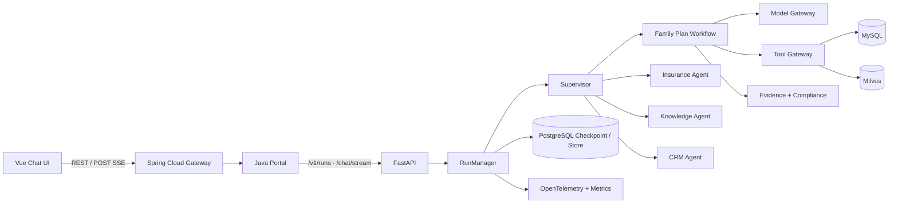
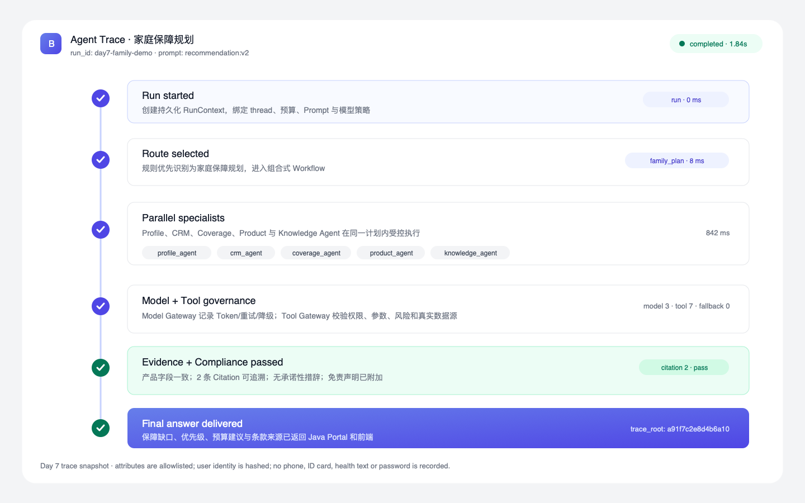

# Insurance Agent Harness

一个面向保险咨询与家庭保障规划的生产化 Agent Harness。系统把确定性的业务编排、可恢复状态、受治理的模型/工具调用、证据引用、合规校验、评测与重放连接成完整链路，同时保留 Java Portal 与旧 `/chat` 接口兼容性。

## 项目价值

- 用确定性 Supervisor 和组合式 Workflow 控制关键业务步骤，Agent 只在边界内自治。
- 对产品、保单与条款采用真实数据源和 Citation；依赖失败时明确降级，不生成 Mock 事实。
- 缺少画像字段时进入 `interrupt/resume`，服务重启后可从 PostgreSQL checkpoint 恢复。
- Model Gateway、Tool Gateway、Prompt Registry、Compliance 和 Trace 形成统一治理层。
- 55 条离线 Eval、Run Replay 和 OpenTelemetry 支持回归、复盘与版本对比。

## 架构



设计原则：外层确定性、内层自治；模型不能越过工具权限、事实校验和合规边界。

## Agent 与 Workflow

| 名称 | 职责 |
|---|---|
| Supervisor | 规则优先路由，决定单 Agent 或家庭组合流程 |
| Profile Agent | 提取年龄、职业、家庭、预算等结构化画像 |
| CRM Agent | 查询现有保单并识别续保与保障组合风险 |
| Coverage Agent | 计算家庭保障缺口 |
| Product Agent | 只从在售产品库选择候选产品 |
| Knowledge Agent | 检索条款证据并生成 Citation |
| Recommendation Agent | 汇总产品、缺口和证据形成草稿 |
| Compliance | 校验产品字段、引用、规则版本和承诺性措辞 |

## Middleware

模型链：Trace → Run Budget → 上下文构建 → PII 脱敏 → 动态 Prompt → 模型选择 → 超时/重试 → 结构化校验 → 合规预检 → 用量统计。

工具链：Trace → Allowlist → 身份与权限 → 参数校验 → 风险/HITL → 限流 → 超时/重试 → 幂等 → 执行 → 输出校验 → PII 脱敏 → Audit。

## 启动

运行前通过环境变量或 Secret 管理器提供凭据，至少包括：

```bash
export JWT_SECRET='<至少 32 字符>'
export NACOS_PASSWORD='<Nacos 密码>'
export NACOS_AUTH_TOKEN='<Base64 编码且不少于 32 字节的随机值>'
export NACOS_AUTH_IDENTITY_KEY='<Nacos 节点身份键>'
export NACOS_AUTH_IDENTITY_VALUE='<Nacos 节点身份值>'
export MYSQL_PASSWORD='<业务库密码>'
export MYSQL_ROOT_PASSWORD='<MySQL root 密码>'
export MYSQL_SERVICE_PASSWORD='<MySQL 服务账号密码>'
export MYSQL_REPLICATION_PASSWORD='<MySQL 复制账号密码>'
export REDIS_PASSWORD='<Redis 密码>'
export MINIO_ROOT_PASSWORD='<MinIO 管理密码>'
export POSTGRES_PASSWORD='<Checkpoint 数据库密码>'
export CERT_PASSWORD='<部署证书口令>'
export DASHSCOPE_API_KEY='<模型服务密钥>'
```

部署目录中的 `__MYSQL_SERVICE_PASSWORD__`、`__REDIS_PASSWORD__` 是必须由部署流程替换的模板占位符，不可直接用于生产。

Python：

```bash
cd /Users/a1234/project/insurance-project/pythonProject
.venv/bin/python server.py
```

Java Portal 与 Gateway：

```bash
cd /Users/a1234/project/insurance-project
sh .tools/apache-maven-3.9.6/bin/mvn -pl insurance-portal/insurance-portal-service -am spring-boot:run
sh .tools/apache-maven-3.9.6/bin/mvn -pl insurance-gateway spring-boot:run
```

前端：

```bash
cd /Users/a1234/project/insurance-project/insurance-chat-frontend
npm install
node node_modules/vite/bin/vite.js --host 0.0.0.0
```

默认链路：前端 → `127.0.0.1:18080` Gateway → `18083` Portal → `18084` Python。

## 家庭保障规划演示

输入：

```text
我 35 岁，是程序员，有一个孩子，家庭年收入 40 万，
每年保险预算 1 万元，现在只有一份百万医疗险，帮我分析保障缺口并推荐方案。
```

页面会依次展示路由、专业模块和完成状态；最终答案下方可展开产品条款 Citation。完整的 3～5 分钟流程见 [Day 7 演示脚本](docs/Day7演示脚本.md)。

## HITL 恢复

缺少画像字段时 Run 返回 `needs_input`，前端显示补充问题。API 恢复方式：

```bash
curl -X POST http://127.0.0.1:18084/v1/runs/<run_id>/resume \
  -H 'Content-Type: application/json' \
  -d '{"payload":{"age":35,"occupation":"程序员","annual_budget":10000}}'
```

同一个 `thread_id` 和 checkpoint 会继续原流程，而不是创建一段无法关联的新回答。

## Eval、Trace 与 Replay

```bash
cd /Users/a1234/project/insurance-project/pythonProject
.venv/bin/python -m evals.runner --suite all
.venv/bin/python -m evals.replay --run-id <run_id>
.venv/bin/python -m evals.replay --run-id <run_id> \
  --prompt-version recommendation:v2 --model-policy cheap
```

- `GET /v1/runs/{run_id}/trace`：Run、Route、Plan、Agent、Model 和 Tool Span。
- `GET /v1/metrics`：运行、模型、工具、中断、合规和无证据指标。
- 最终 Eval 报告：[day7-final.json](pythonProject/evals/reports/day7-final.json)。



## 验证

```bash
cd /Users/a1234/project/insurance-project/pythonProject
.venv/bin/python -m ruff check src tests evals
.venv/bin/python -m pytest tests -q
.venv/bin/python -m evals.runner --suite all

cd /Users/a1234/project/insurance-project
sh .tools/apache-maven-3.9.6/bin/mvn \
  -pl insurance-portal/insurance-portal-service -am test \
  -Dtest=ChatServiceImplTest -Dsurefire.failIfNoSpecifiedTests=false

cd /Users/a1234/project/insurance-project/insurance-chat-frontend
node node_modules/vite/bin/vite.js build
```

五个 Day 7 场景与故障证据见 [最终验证报告](pythonProject/evals/reports/day7-e2e.md)。

## 重构前后

| 维度 | 重构前 | 重构后 |
|---|---|---|
| 编排 | 单路 Supervisor | 组合式 Workflow |
| 状态 | MemorySaver | PostgreSQL Checkpointer |
| 长期记忆 | 代码存在但入口未启用 | 正式 Store 生命周期 |
| Agent 生命周期 | 全局可变引用 | AgentSpec + RunContext |
| 工具 | 普通函数 | Tool Gateway + Middleware |
| Prompt | 散落常量 | 版本化 Prompt Registry |
| HITL | 提示文本 | interrupt/resume 协议 |
| RAG | 可能静默 Mock | Evidence + Citation |
| 错误 | 大量吞异常 | 类型化错误与安全降级 |
| 质量 | 手工试用 | 55 条 Eval 数据集 |
| 可观测性 | 日志 | Agent/Model/Tool Trace |
| 重放 | 无 | Run Replay |

## 已知限制

- 当前 `/chat/stream` 在 Run 完成后按标准 SSE 顺序返回阶段事件，尚未把模型 token 逐字传输到浏览器。
- PostgreSQL、MySQL、Milvus、Nacos 和模型服务仍需外部运行环境；默认测试通过 Fake/Mock 隔离这些依赖。
- 人工质量抽样不能由自动化自证，最终报告仍保留人工复核标记。
- Java 全 Reactor 的两个历史 Bean 拷贝测试在 JDK 21 下会失败；Portal 本次新增测试和模块编译可独立通过。
